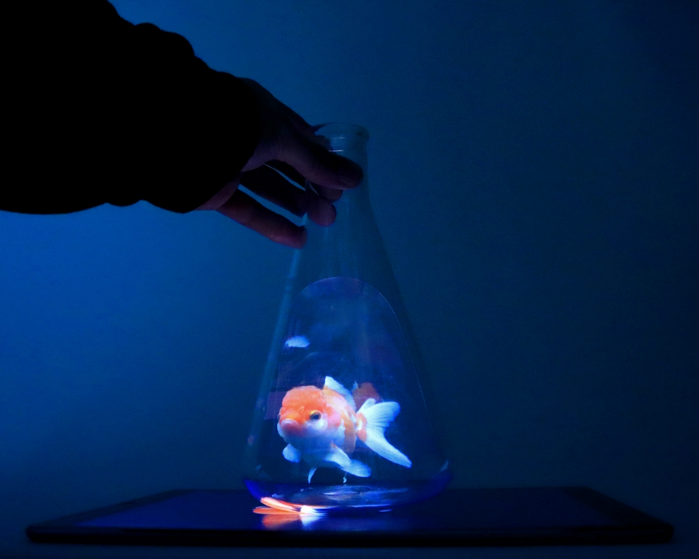

Maker Media GmbH

***

# Flaschengeist

**In diesem Erlenmeyerkolben spukt ein sogenannter Pepper's Ghost, ein halbtransparentes Bild mit holografischer Anmutung. So eine gespenstische Erscheinung lässt sich in einem beliebigen Glas leicht selbst beschwören. Man braucht zusätzlich nur ein Stück Polycarbonat und ein Display – egal, ob Handy, Röhrenfernseher oder Oszilloskop. **

Hier gibt es die Schablone für die Kunststoffplatte im Inneren des 1000-ml-Erlenmeyerkolbens zum Drucken im Ordner [_pdf_](./pdf/)). 

Der Autor des Artikels lebt in den USA und hat einen Erlenmeyerkolben von Karter Scientific verwendet. Diesen mit der Typbezeichnung  213G22 ist auch hierzulande bei [Amazon](https://www.amazon.com/250ml-Narrow-Erlenmeyer-Borosilicate-Graduated/dp/B006VYY1IQ) zu bekommen, kostet aber viel im Versand. Dafür sollte dann die hier zur Verfügung gestellte Schablone ziemlich gut passen. 

Andere Kolben mit 1000 ml Fassungsvermögen von [deutschen Versandhändlern](https://www.glas-fabrik.de/Erlenmeyerkolben-1000ml-Weithals/GT00154) sind ggf. günstiger, erfordern aber mehr Anpassungen an der Schablone. 

Die Make-Redaktion freut sich über Schablonen für andere Gefäße, bitte als PDF per Mail an [mail@make-magazin.de](mailto:mail@make-magazin.de) schicken, mit genauem Link zum verwendeten Gefäß. Wir veröffentlichen solche Schablonen hier gerne. 

Der vollständige Artikel zum Projekt steht in der **[Make-Ausgabe 1/24](https://www.heise.de/select/make/2024/1/2334113395416761993)**.